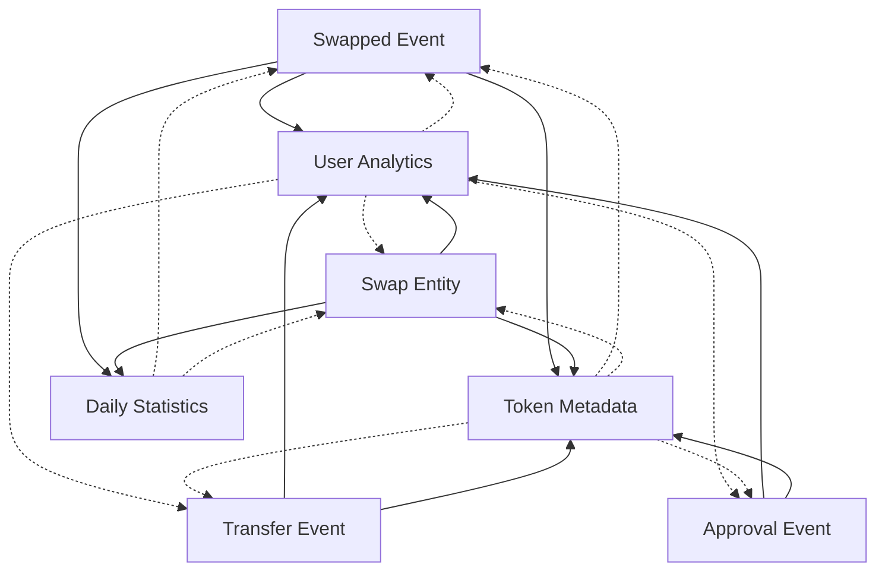

# 1Inch Aggregation Subgraph

A comprehensive subgraph for tracking 1inch protocol activity on Ethereum mainnet, including swap events, user analytics, token metadata, and daily statistics.

## Live Subgraph

**Graph Studio URL**: https://thegraph.com/studio/subgraph/1-inch-aggregation  
**Query Endpoint**: https://api.studio.thegraph.com/query/111767/1-inch-aggregation/0.0.8

## Entity Relationship Diagram



## Architecture

### Data Sources
1. **AggregationRouterV6** (0x111111125421cA6dc452d289314280a0f8842A65)
   - Core 1inch aggregation contract
   - Tracks Swapped events directly
   - Start block: 19212918

2. **1INCH Token** (0x111111111117dC0aa78b770fA6A738034120C302)
   - Governance token transfers and approvals
   - Used for token analytics

3. **LimitOrderProtocol** (0x1111111254EEB25477B68fb85Ed929f73A960582)
   - Limit order fills and cancellations
   - Optional analytics

4. **SwapTracker** (Generic ERC20)
   - Tracks all transfer events
   - Derives Swap entities from transfer pairs
   - Identifies complete swaps via router interactions

### Entity Types

#### Core Events (Immutable)
- **Swapped**: Direct events from AggregationRouterV6
- **Transfer**: All ERC20 transfer events
- **Approval**: ERC20 approval events
- **OrderFilled**: Limit order completions

#### Analytics Entities (Mutable)
- **User**: Address-based analytics with aggregated metrics
- **Token**: Token metadata and transfer statistics
- **DailyStats**: Daily aggregated statistics
- **Swap**: Enhanced swap entities derived from transfer pairs

## Setup & Deployment

### Prerequisites
- Node.js 18+
- Graph CLI: `npm install -g @graphprotocol/graph-cli`

### Installation
```bash
# Clone the repository
git clone git@github.com:PaulieB14/1Inch-Aggregation.git
cd 1Inch-Aggregation

# Install dependencies
npm install

# Generate types
graph codegen

# Build the subgraph
graph build

# Deploy to Graph Studio
graph deploy 1-inch-aggregation
```

### Configuration
- **Network**: Ethereum mainnet
- **Start Block**: 19212918 (AggregationRouterV6 deployment)
- **Spec Version**: 1.0.0
- **API Version**: 0.0.7

## Query Examples

### Get Recent Swaps
```graphql
{
  swaps(first: 10, orderBy: blockNumber, orderDirection: desc) {
    id
    user
    inputToken
    outputToken
    inputAmount
    outputAmount
    blockNumber
    blockTimestamp
    transactionHash
  }
}
```

### Get User Analytics
```graphql
{
  users(first: 10, orderBy: totalVolume, orderDirection: desc) {
    id
    totalSwaps
    totalVolume
    swapCount
    firstSeen
    lastSeen
  }
}
```

### Get Token Statistics
```graphql
{
  tokens(first: 10, orderBy: transferCount, orderDirection: desc) {
    id
    symbol
    name
    decimals
    transferCount
    approvalCount
  }
}
```

### Get Daily Statistics
```graphql
{
  dailyStats(id: "2024-02-13") {
    id
    date
    totalVolume
    swapCount
    uniqueUsers
  }
}
```

## Key Features

### Swap Detection
- **Direct Events**: Captures Swapped events from AggregationRouterV6
- **Derived Swaps**: Creates Swap entities from transfer pairs to/from router
- **Complete Tracking**: Both input and output transfers for full swap context

### Analytics
- **User Metrics**: Total swaps, volume, first/last seen timestamps
- **Token Analytics**: Transfer counts, approval counts, metadata
- **Daily Aggregations**: Volume, swap counts, unique users per day

### Performance Optimizations
- **@derivedFrom Relationships**: Avoids large arrays for scalability
- **Immutable Events**: Core events are immutable for performance
- **Efficient Indexing**: Optimized for high-volume data processing

## Current Status

- **Version**: 0.0.8
- **Status**: Active and indexing
- **Current Block**: 19214009+
- **Entities**: 2,000+ and growing
- **Data Sources**: 4 contracts tracked
- **Events**: Transfer, Approval, Swapped, OrderFilled

## Contributing

1. Fork the repository
2. Create a feature branch
3. Make your changes
4. Test with `graph build`
5. Submit a pull request

## License

MIT License - see LICENSE file for details

## Links

- [1inch Protocol Documentation](https://docs.1inch.io/)
- [The Graph Documentation](https://thegraph.com/docs/)
- [Graph Studio](https://thegraph.com/studio/) 